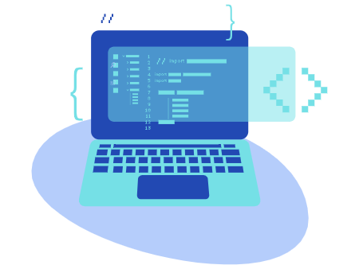
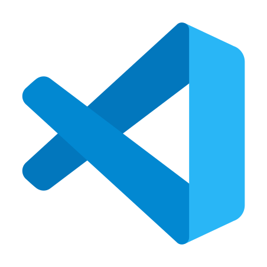
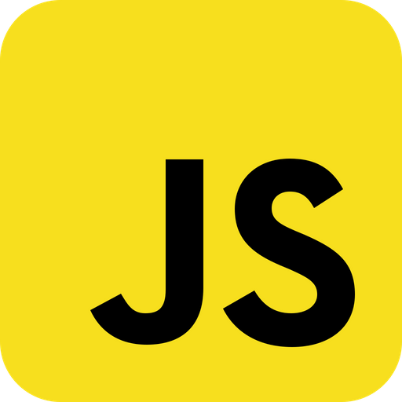
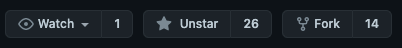

# Basic Training

### Table of Contents

**[Introduction](#Introduction)** 
**[Purpose](#Purpose)** 
**[Fundamentals](#Fundamentals)** 
**[Tool Bag](#Tool-Bag)** 
**[Course Outline](#Course-Outline)** 
**[Contributions](#Contributions)** 

## Introduction

First, please give this repo a star ⭐️!

If you are interested in Ethereum development, be sure to have a look at our DevPortal and other course offerings.

- [Dev Portal](https://consensys.net/developers/)
- [Course Offerings](https://consensys.net/academy/)

### Purpose

This course aims to teach software developers the best practices for using fundamental software development tools.

It is aimed at new learners and intermediate software engineers. This course is helpful for general software engineering and for those wishing to enter blockchain development. Prior to digging into Web3 development, having a firm grasp on some of the core tools you'll use throughout your projects will better equip you for success.

This course helps showcase the tools a developer has at their fingertips and will show you some tips and tricks along the way.

## Fundamentals

It's the little things that count. In a professional software developer's life, these tools are like air: ever-present, all-encompassing, and direly needed. To be at our best, we need to learn how to utilize these properly.

We believe being a developer means you're a forever student. New versions, syntax, tools, and documentation constantly roll out, only learning the minimum in order to achieve X may be a slippery slope.

Too often, we are taught what is "good enough" to accomplish the job, but not necessarily the best practices. This results in compounding bad practices, resulting in wasted time and unnecessary agony.

We built this mini-course to give a place to learn these fundamental tools in a deliberate, focused way. This came from our experience of seeing many people signing up for our [Blockchain Frontend Bootcamp](https://consensys.net/academy/bootcamp/) and having to learn the fundamentals, frontend development, and blockchain skills.

Learning these tools is similar to learning how to breathe properly. It seems foolish at first. But if done properly, it's the key to a meditative rest that allows you to get into the zone. Or at least not deal with an unnecessary disturbance in your everyday workflow.

We hope to pre-emptively help with many of the issues we've seen people struggle with over the years.

## Tool Bag

If you're staring at a code editor for hours on end, shouldn't it be tricked out in the best way possible? What you learn here could make your developer experience not only more efficient but fun!

Even if you're very familiar with the technology in these lessons, we encourage you to flip through them. Along with introductory material, we've curated tips and tricks for optimizing and improving your use of these tools.

We want to help ensure you not only have the tools, but the fundamental knowledge on how to make them work for you, espcially as you start to develop your workflow & preferences.

## Course Outline

In this mini-course, we will go through:

- Unix / Linux Operating Systems 
- Command Line 
- Code Editor 
- Git 
- Javascript / Node / Web Frameworks 

We will provide some material in these lessons, but we'll mainly provide links to other places where you can learn more. There are a number of fantastic resources we point you towards and similarly to being a dev, exploring the links and documentation will help solidify your knowledge.

If you never left the mini-course, after completing it, you'll be able to find your way around a computer pretty well. However, please follow the links within a lesson to dive deeper, deepen your knowledge, and enhance your developer experience.

Now, let's take a deep breath, relax, and learn the way.

## Contributions

This course will grow over time. Contributions are HIGHLY encouraged and desired. If you see an error, please open an issue and submit a pull request.

We envision this course to grow over time—sections on "contributing to open source" would be helpful. Should you have an idea, please open an issue and discuss it with the team. Pull requests are highly appreciated.

Please see [CONTRIBUTING.md](./CONTRIBUTING.md) for how to make a contribution.

An example of this process found below:
Found in the top right of the repository information 

1. Fork it (<https://github.com/ConsenSys-Academy/basic-training>)
2. Create your feature branch (`git checkout -b branchName`)
3. Commit your changes (`git commit -m 'Added X input'`)
4. Push to the branch (`git push origin branchName`)
5. Create a new Pull Request

Built by [ConsenSys](www.consensys.net/) and

